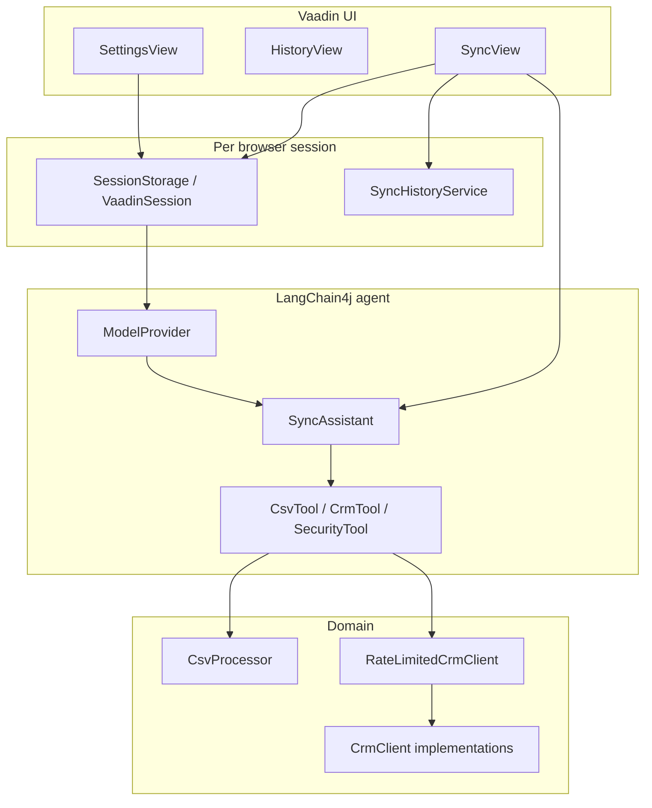

# VectraSync

CRM-agnostic web app for CSV → CRM sync. An LLM ([LangChain4j](https://github.com/langchain4j/langchain4j)) proposes column mappings from live CRM schema discovery; you review, then run the sync. UI is [Vaadin 24](https://vaadin.com/) on [Spring Boot 3.3](https://spring.io/projects/spring-boot) with Java 21 virtual threads.

## Architecture

The app is a single Spring Boot process: Vaadin server-side UI, Spring-managed services, and no separate API tier for the browser.



**Layers and responsibilities**

| Layer | Role |
|-------|------|
| **UI (`com.vectrasync.ui`)** | `MainLayout` + routes: **Sync** (upload, mapping grid, execute, live trace), **History** (reports), **Settings** (keys, CRM kind). Long work runs on **virtual threads** so the UI thread stays responsive; LLM keys are passed explicitly into the agent factory when off the UI thread. |
| **Session (`SessionStorage`)** | Implements `KeyResolver` for the LLM. Stores LLM key, CRM key, and `CrmKind` in `VaadinSession` attributes only—no server-side credential files. |
| **Agent (`com.vectrasync.agent`)** | `SyncAssistant` (LangChain4j AI service) with system prompts for schema-first mapping and ReAct-style streaming. `SyncAssistantFactory` builds an instance per request with tools and chat memory. `MappingParser` extracts and parses JSON arrays from model output (including fenced blocks). |
| **Tools** | `CsvTool` reads headers and previews rows via `CsvProcessor`. `CrmTool` exposes schema and upsert. `SecurityTool` masks PII in error/trace text via `SecurityChecker`. |
| **CRM (`com.vectrasync.crm`)** | `CrmClient` interface: schema, optional find-by-email, upsert. **MockCrmClient** is in-memory for demos. **AttioClient** calls Attio’s HTTP API. **TwentyClient** exists as a stub. Outbound calls can be wrapped in **RateLimitedCrmClient** (Resilience4j). |
| **CSV (`com.vectrasync.csv`)** | Apache Commons CSV: header detection, streaming rows, `MappingSuggestion` model used by both the grid and execution. |
| **History** | `SyncHistoryService` is `@VaadinSessionScope`: last **50** `SyncReport` entries in memory for the session. |

**Concurrency and integration**

- `spring.threads.virtual.enabled=true`: background propose/execute work uses `Thread.ofVirtual()`.
- `ModelProvider` chooses OpenAI or Gemini from key prefix; timeouts are configured on the HTTP clients.
- Vaadin **Push** (`@Push` on the application class) supports live updates from background work back to the browser.

## Functionality

**End-to-end flow**

1. **Settings** — User stores an LLM API key (OpenAI or Gemini) and selects **Mock** or **Attio** with an Attio API key when needed. Keys never leave the session store shown in the UI disclaimer.
2. **Upload** — User uploads one CSV file (multipart limit 50 MB). File is copied to a temp path; the UI records size and enables mapping.
3. **Propose mapping** — A new `SyncAssistant` is built with tools bound to the active CSV path and a `CrmClient` built from session (Attio or mock), wrapped with a rate limiter. The model is instructed to call `getCrmSchema`, `getCsvHeaders`, and optionally `previewCsvRows`, then return **only** a JSON array of `{ csvField, crmField, confidence, reason }`. `MappingParser` turns that into typed suggestions shown in the grid.
4. **Execute sync** — For each CSV row, the app maps values through approved suggestions, builds a `Contact` map, and calls `upsertContact`. Progress and errors are streamed to the **Live trace** console (PII masked on errors). On completion, a `SyncReport` is appended to **History**.

**What the product does *not* do today**

- No persisted database for contacts, mappings, or audit beyond the in-session list.
- No OAuth for CRMs—only API keys in session.
- No column-level approval UI beyond trusting the grid as “approved” when Execute is clicked.
- `streamReasoning` exists on the assistant interface but the main wizard flow centers on `proposeMapping` plus trace lines from the app, not full token streaming of reasoning into the console.

## Requirements

- JDK 21
- Maven 3.8+
- An API key for **OpenAI** (`sk-…`) or **Google Gemini** (`AIza…`) for mapping and trace streaming

## Run locally

```bash
mvn spring-boot:run
```

Open [http://localhost:8080](http://localhost:8080). Vaadin regenerates `src/main/frontend/generated/` on build; it is gitignored—run Maven at least once after clone.

### Production build

Frontend bundles are built when the `production` Maven profile is active (see `pom.xml`). Use your usual Spring Boot packaging flow with that profile for deployable JARs.

## Configuration (UI)

All secrets are **session-only** (in-memory for your browser); they are not written to application properties or the server filesystem by this app.

| Setting | Purpose |
|--------|---------|
| **LLM API key** | Required for AI mapping and live trace. Provider is inferred from the key prefix (`sk-` → OpenAI `gpt-4o`, `AIza` → Gemini `gemini-1.5-flash`). |
| **Target CRM** | **Mock** — in-memory demo, no external CRM. **Attio** — live [Attio](https://attio.com/) API; paste an Attio API key from your workspace. |

Use **Settings** in the app to save keys before running sync on the home view.

## CRM notes

- **Attio**: client targets `https://api.attio.com/v2` with your API key. Integration tests use WireMock, not your real workspace.
- **Twenty**: a `TwentyClient` exists in the codebase but is not wired in the Settings UI; Attio and Mock are the selectable targets today.

## Tests and logs

```bash
mvn test
```

File logging defaults to `logs/vectrasync.log` (see `application.properties`). Console logging includes `com.vectrasync` at DEBUG.

## Future improvements

**Product and UX**

- Editable mapping grid (per-row accept/reject, manual overrides) before execute.
- Wire **Twenty CRM** (or others) behind the same `CrmClient` contract and extend Settings with provider-specific OAuth or API key flows.
- Surface `TokenStream` / `streamReasoning` in the live trace for true streamed “thought” lines alongside tool results.
- Dry-run mode: simulate upserts against mock or a shadow environment with a diff report.

**Data and operations**

- Persist sync runs, mappings, and CSV metadata (Postgres or similar) instead of session-only history.
- Idempotency keys and retry dashboards for failed rows; dead-letter export (CSV/JSON).
- Multi-tenant auth (login) with encrypted secret storage (KMS, Vault) instead of only Vaadin session keys.

**Engineering**

- Structured logging (JSON), metrics (Micrometer), and health checks for production.
- CI pipeline (GitHub Actions): `mvn verify` on each push, cache Maven, optional Vaadin production build.
- Contract tests per CRM adapter; fuzz tests for `MappingParser` on hostile model output.
- Configurable models and temperature via Settings or `application.properties` profiles.

## License

See [LICENSE](LICENSE) in this repository.
